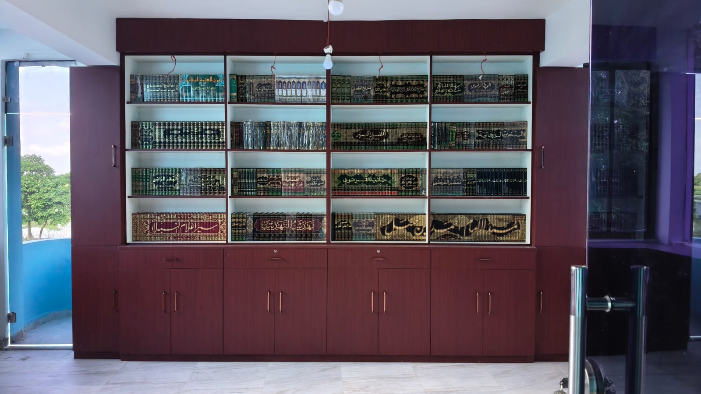

# CLAUDE.md

This file provides guidance to Claude Code (claude.ai/code) when working with code in this repository.

---

## Project Overview

A complete, multi-page static website for **Jamia Nooria Gulshan-e-Zahra** (جامعہ نوریہ گلشن زہراء), an Islamic educational institution. Deployable on GitHub Pages. Stack: HTML5, CSS3, vanilla JavaScript, and jQuery — no frameworks, no backend, no build tools.

---

## Viewing Locally

No build step needed. Open any HTML file directly in a browser, or run a local server to avoid CORS issues with images:

```bash
python -m http.server 8080
# Then visit http://localhost:8080
```

---

## File Structure

```
/
├── index.html          # Home page
├── about.html          # About, Mission, Vision, Leadership
├── academics.html      # Courses & Syllabus
├── facilities.html     # Campus Facilities
├── gallery.html        # Photo & Video Gallery
├── support.html        # Donate + Contact + Map
├── css/style.css       # Single shared stylesheet
├── js/main.js          # Single shared JS file (jQuery-based)
├── images/             # All source images (WhatsApp JPEG files)
├── .nojekyll           # Required for GitHub Pages
└── favicon.ico
```

All six HTML pages share the same `css/style.css` and `js/main.js`. There is no per-page CSS or JS.

---

## Image Filenames

All images in `images/` are WhatsApp exports with spaces and special characters in their names (e.g., `WhatsApp Image 2026-02-22 at 12.36.15 PM.jpeg`). When referencing them in HTML or CSS, URL-encode spaces as `%20` and parentheses as `%28`/`%29`:

```html

```

There is a `logo.png` — inside images as the logo/hero. The image is suitable for a logo/hero.

---

## CDN Dependencies (add to every HTML page)

```html
<!-- Google Fonts -->
<link href="https://fonts.googleapis.com/css2?family=Amiri:wght@400;700&family=Poppins:wght@300;400;500;600;700&display=swap" rel="stylesheet">
<!-- Font Awesome -->
<link rel="stylesheet" href="https://cdnjs.cloudflare.com/ajax/libs/font-awesome/6.5.0/css/all.min.css">
<!-- jQuery -->
<script src="https://code.jquery.com/jquery-3.7.1.min.js"></script>
<!-- Shared styles and scripts -->
<link rel="stylesheet" href="css/style.css">
<script src="js/main.js" defer></script>
```

All paths must be **relative** (never start with `/`) for GitHub Pages compatibility.

---

## Design System

CSS custom properties defined in `:root` in `style.css`:

| Variable | Value | Use |
|---|---|---|
| `--green` | `#1a5c38` | Primary brand color |
| `--gold` | `#d4af37` | Accents, borders, headings |
| `--cream` | `#f5f0e8` | Section backgrounds |
| `--charcoal` | `#222222` | Body text |
| `--white` | `#ffffff` | Card backgrounds |

Fonts: `'Amiri'` for headings (Islamic script feel), `'Poppins'` for body text.

---

## JavaScript Architecture (js/main.js)

All interactivity lives in one file, structured around:

1. **Preloader** — hide on `$(window).load()`
2. **Navbar** — sticky with hide-on-scroll-down / show-on-scroll-up; hamburger menu for mobile; active link based on `window.location.pathname`
3. **Scroll animations** — Intersection Observer triggers jQuery `.addClass('visible')` for fade-in/slide-up on `.animate-on-scroll` elements
4. **Counters** — trigger count-up animation (0 → target) when `.stats-section` enters viewport
5. **Accordion** — jQuery toggle for course detail cards on `academics.html`
6. **Lightbox** — custom CSS+jQuery lightbox (no external plugin) for gallery images
7. **Gallery filter** — jQuery show/hide by `data-category` attribute on image items
8. **Back-to-top button** — appears after 300px scroll
9. **Clipboard copy** — "Copy Account Number" button on `support.html`

---

## GitHub Pages Deployment

1. Push all files to a GitHub repository
2. Go to Settings → Pages → Source: `main` branch, root `/`
3. The `.nojekyll` file in root prevents Jekyll processing

---

## Canonical Content (Do Not Change)

| Field | Value |
|---|---|
| Institution | Jamia Nooria Gulshan-e-Zahra |
| Urdu name | جامعہ نوریہ گلشن زہراء |
| Est. | March 2015 |
| Students | 600+ |
| Teachers | 26 female (19 teaching staff) |
| Campus | 35,000 sq. ft., Sibrampur, Uttar Dinajpur, WB 733209 |
| Phone | +91 8170090117 / +91 7384969192 |
| Email | jamianooriagulshanezahra@gmail.com |
| Bank A/C Name | IMAM AHMED RAZA SUNNI HANAFI MUSLIM WELFARE EDUCATION SOCIETY |
| Account No | 4929002100001280 |
| IFSC | PUNB0492900 |
| Bank | PUNJAB NATIONAL BANK, KANKI, UTTAR DINAJPUR, WB |
| Society | Imam Ahmed Raza Sunni Hanafi Muslim Welfare Education Society (Regd.) |

---

## Detailed Page Specifications

### index.html — Home
- **Hero**: Full-viewport parallax with overlay. Heading: "Jamia Nooria Gulshan-e-Zahra", Subheading: "جامعہ نوریہ گلشن زہراء", Tagline: "Empowering Muslim Women Through Islamic Education — Ahle Sunnat Wa Jama'at". CTAs: "Explore Courses" → `academics.html`, "Support Jamia" → `support.html`
- **Stats bar**: Animated counters — 600+ Students | 26 Teachers | 35,000 sq.ft. | Est. 2015
- **About snippet**: 2-col (text left, image right). "Read More" → `about.html`
- **Mission & Vision**: Two side-by-side cards
- **Courses preview**: 5 icon cards (Deeniyat, Nazira Wa Tajweed, Hifz e Quraan, Qira't, Dars e Nizami). "View All Courses" → `academics.html`
- **Facilities strip**: 6 icons — Library, Computer Centre, Ladies Masjid, Hostel, Darul Ifta, Dining Hall
- **Gallery teaser**: 3-image grid with lightbox. "View Full Gallery" → `gallery.html`
- **Donation CTA**: Full-width green banner. "Donate Now" → `support.html`
- **Footer**: Same footer on all pages (logo, quick links, contact, social icons, copyright)

### about.html — About
- Hero banner, institution history text, 3 leadership cards (gold border), Mission box, Vision box, animated staff counter cards, "Run By" text

### academics.html — Academics
- Hero banner, 5 course cards with jQuery accordion expand/collapse, Modern Studies cards (6), Language pills (6), Bazm e Raza weekly training section, Examination system section

### facilities.html — Facilities
- Hero banner, campus overview text, 15 facility cards (icon + title + description), animated infra stats, 3 future plans cards

### gallery.html — Gallery
- Hero banner, jQuery filter tabs (All / Campus / Classrooms / Events / Students) using `data-category` on items, full image grid with custom lightbox, 2-3 placeholder video cards ("Video Coming Soon")

### support.html — Support
- Hero banner, Why Donate section, Bank Details card with "Copy Account Number" button, 2-col Contact section (form left with `mailto:` action, details right), Google Maps iframe embed for Sibrampur Uttar Dinajpur

### Shared header (all pages)
Top bar: phone numbers + email. Navbar: logo left, links right (Home | About | Academics | Facilities | Gallery | Support Jamia), hamburger on mobile.
